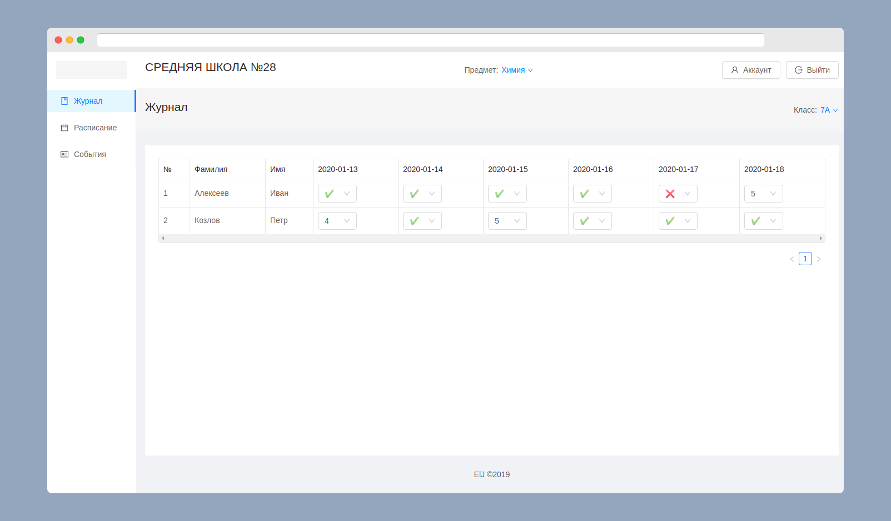
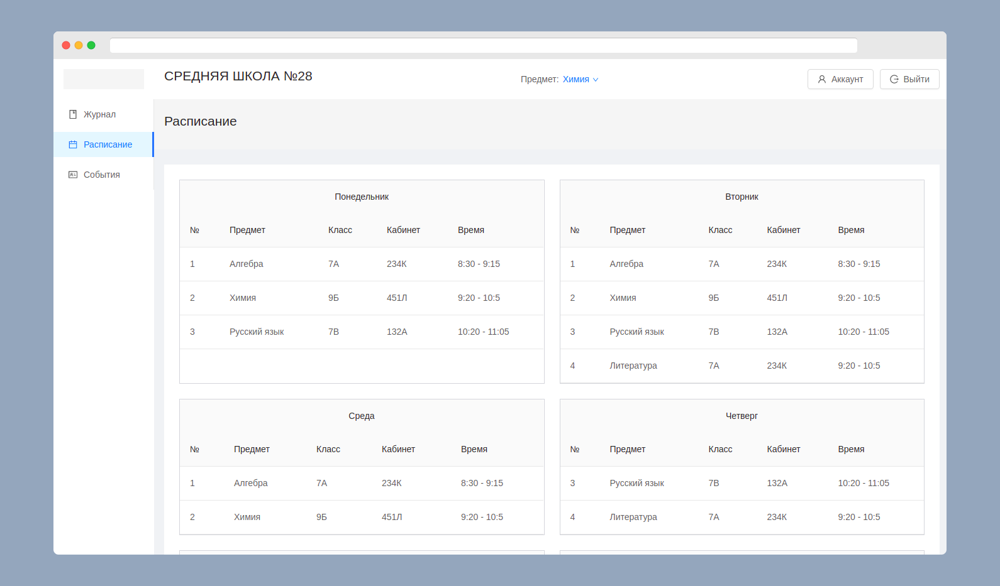
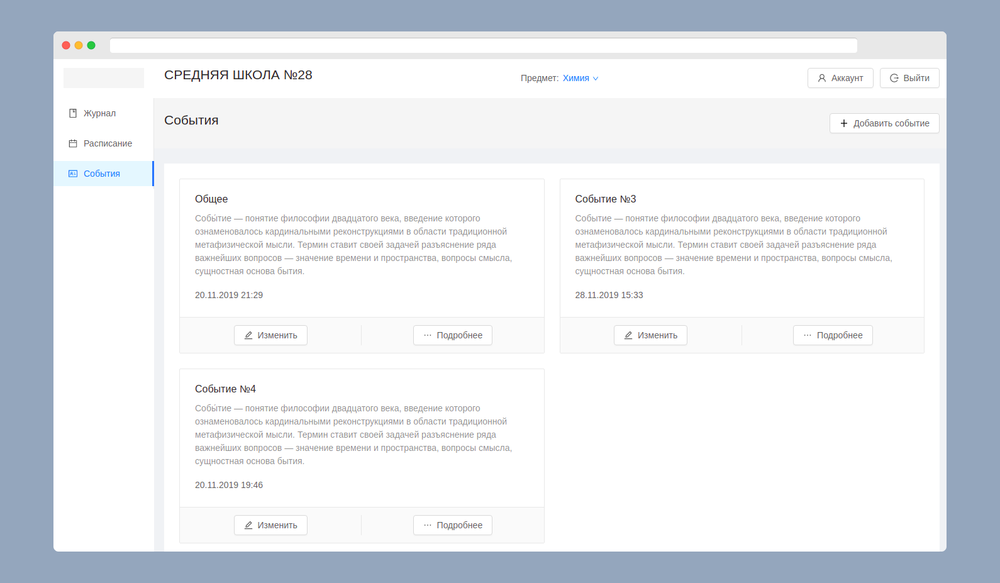
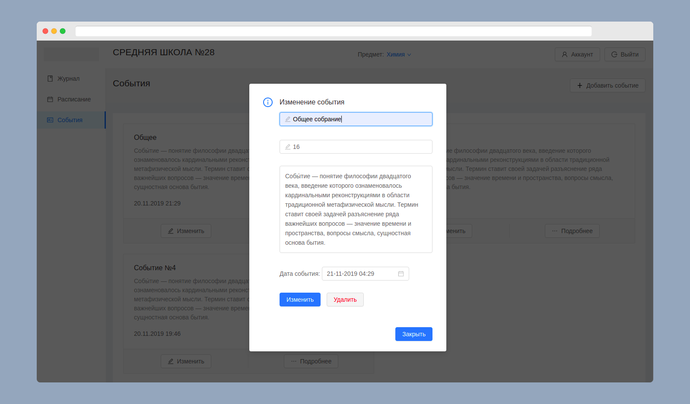

<br />
<p align="center">
  <a href="https://github.com/Raysultan/el-journal">
    
  </a>

  <h1 align="center">Электронный журнал</h1>

<!-- TABLE OF CONTENTS -->
## Содержание

* [О проекте](#о-проекте)
  * [Технические детали](#технические-детали)
  * [Скриншоты](#скриншоты)
* [Локальная установка](#локальная-установка)
  * [Пререквизиты](#пререквизиты)
  * [Установка](#установка)
* [Лицензия](#лицензия)
* [Контакты](#контакты)


## О проекте

Система для учета успеваемости учеников средних школ. Включает в себя учет успеваемости, отслеживания текущего расписания и управления классными событиями.

Приложение представляет собой личный электронный журнал, позволяющий частично автоматизировать такую обязанность учителей, как заполнение электронного журнала. Данные в электронном виде существенно упрощает работу преподавателей по анализу и сбору информации о посещениях и успеваемости.


### Технические детали

* [Django](https://www.djangoproject.com/)
* [Django Rest Framework](https://www.django-rest-framework.org/)
* [React JS](https://ru.reactjs.org/)
* [Redux](https://redux.js.org/)
* [PostgreSQL](https://www.postgresql.org/)
* [styled-components](https://www.styled-components.com/)
* [axios](https://github.com/axios/axios)

### Скриншоты






## Локальная установка

### Прериквизиты

Для того чтобы запустить проект вам понадобиться [yarn](https://yarnpkg.com/lang/en/) версии 1.21.1 или выше и [Python3](https://www.python.org/).
* yarn
```sh
sudo apt-get update && sudo apt-get install yarn
```
* Python3
```sh
sudo apt-get update
sudo apt-get install python3.6
```

### Установка

1. Клонируйте репозитории с клиентской и сервеной частями
```sh
git clone https://github.com/Raysultan/el-journal
git clone https://github.com/Raysultan/elj-backend
```
2. Установите требуемые зависимости
- Для клиентской части:
```sh
yarn install
```
- Для серверной части:
```sh
pip install requirements.txt
```
3. Можете запускать проект
```shell
yarn start
```
```shell
python3 manage.py runserver
```

Теперь вы может проходить по следующим ссылкам:
для клиента: http://127.0.0.1:3000
для сервера: http://127.0.0.1:8000


## Серверная часть и API

Ссылка на репозиторий: [https://github.com/Raysultan/elj-backend](https://github.com/Raysultan/elj-backend)


## Лицензия

Распространяется по лицензии MIT. Смотрите раздел "License" для получения дополнительной информации.


## Контакты

Райсултан Каримов - ki.xbozz@gmail.com

Ссылка на проект: [https://github.com/Raysultan/el-journal](https://github.com/Raysultan/el-journal)
